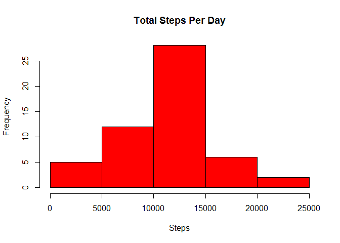
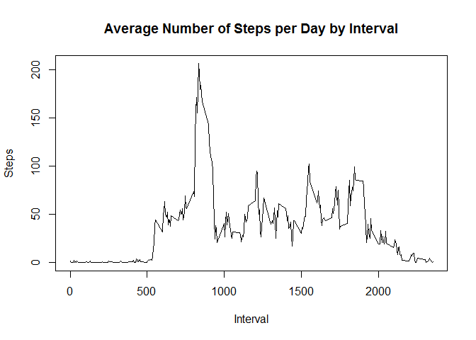
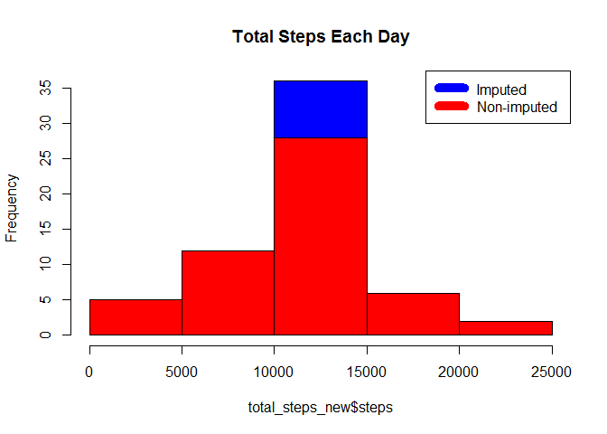
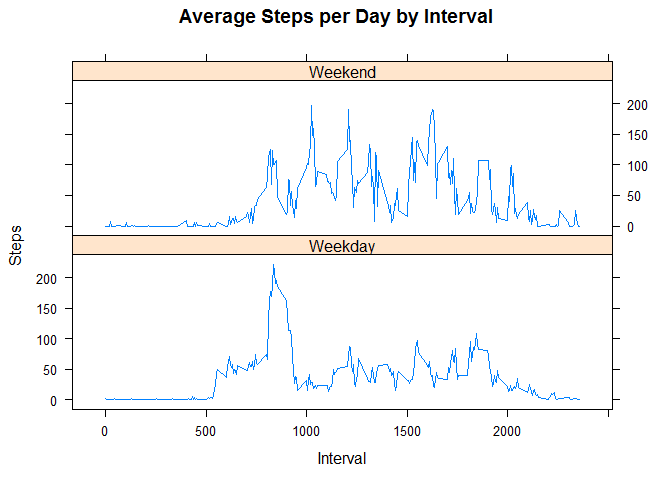

# Reproducible Research: Peer Assessment 1


## Loading and preprocessing the data


```r
url <- "http://d396qusza40orc.cloudfront.net/repdata%2Fdata%2Factivity.zip"
if(!file.exists("application.zip")) {
        temp <- tempfile()
        download.file(url,temp)
        unzip(temp)
        unlink(temp)
}

activity <- read.csv("./activity.csv")
```

## What is mean total number of steps taken per day?

```r
plot.new()
total_steps <- aggregate(steps ~ date, activity, sum)
hist(total_steps$steps, main = paste("Total Steps Per Day"), col="red", xlab="Steps")
```

 

```r
steps_mean <- mean(total_steps$steps)
steps_median <- median(total_steps$steps)
```


## What is the average daily activity pattern?


```r
total_steps_by_interval <- aggregate(steps ~ interval, activity, mean)
with(total_steps_by_interval, plot(total_steps_by_interval$interval, total_steps_by_interval$steps, main = "Average Number of Steps per Day by Interval", type = "l", xlab="Interval", ylab="Steps"))
```

 

```r
most_average <- total_steps_by_interval[which.max(total_steps_by_interval[,2]),1]
```

## Imputing missing values


```r
missing_steps <- sum(!complete.cases(activity))

imputed_activity <- transform(activity, steps = ifelse(is.na(activity$steps), total_steps_by_interval$steps[match(activity$interval, total_steps_by_interval$interval)], activity$steps))
total_steps_new <- aggregate(steps ~ date, imputed_activity, sum)

plot.new()
hist(total_steps_new$steps,  main = paste("Total Steps Each Day"), col="blue")
hist(total_steps$steps, main = paste("Total Steps Each Day"), col="red", xlab="Number of Steps", add=T)
```

 

```r
steps_mean_new <- mean(total_steps_new$steps)
steps_median_new <- median(total_steps_new$steps)

diff_in_mean <- steps_mean_new - steps_mean
diff_in_median <- steps_median_new - steps_median
total <- sum(total_steps_new$steps) - sum(total_steps$steps)
```

## Are there differences in activity patterns between weekdays and weekends?

```r
weekday <- ifelse(weekdays(as.Date(activity$date)) == "Satday" | weekdays(as.Date(activity$date)) == "Sunday", "Weekend", "Weekday")
activity_dow <- cbind(activity, weekday)

total_steps_by_interval_new <- aggregate(steps ~ interval + weekday, activity_dow, mean)

library(lattice)
xyplot(total_steps_by_interval_new$steps ~ total_steps_by_interval_new$interval|total_steps_by_interval_new$weekday, main="Average Steps per Day by Interval",xlab="Interval", ylab="Steps",layout=c(1,2), type="l")
```

 


